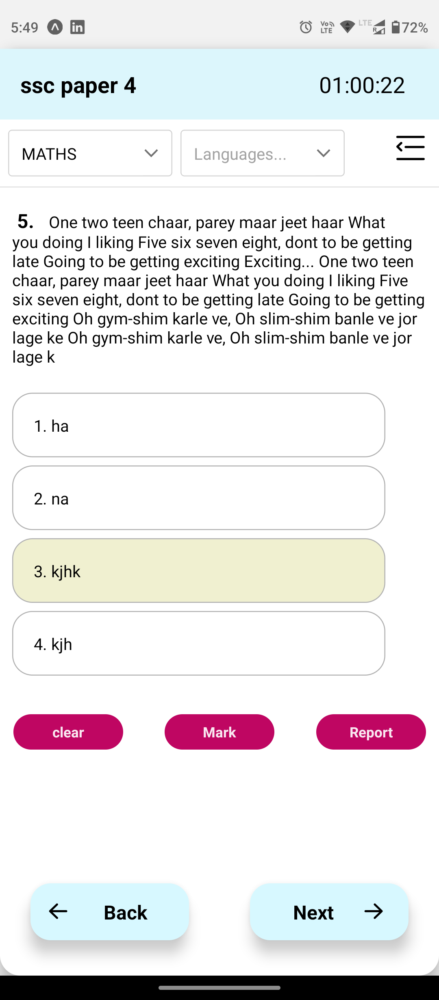
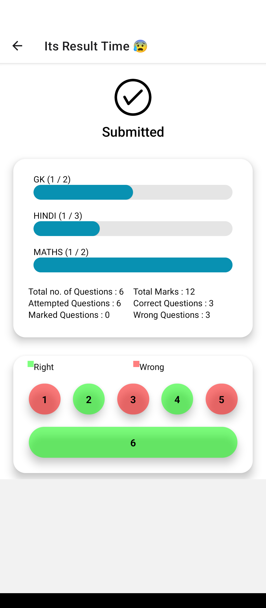

# Mock Test APP
It's an exam system or say quizz app made to be operable on Android phones. Here users can practise for different types of exams even without internet connections.




## This project will solve problems of :-
* students living in low internet connectivity area.
* students, who don't have big screens to practise computer based exams, can practise it on their phone itself.

## Technology Stack
* React Native: for cross platform support.
* JavaScript: Primary programming language.
* yarn: package manager.

### Local Installation
Note: Before installing make sure that you have 'Node.js' & 'git' installed in your computer.
* Go to folder where you want install this repo.
* Right click and you will get some options.
* Click on ' Git Bash Here ' and you will get a linux like [CLI](https://en.wikipedia.org/wiki/Command-line_interface).
* Clone repositary

```bash
git clone https://github.com/kumarvikramshahi/Mock_Test_APP
```
* Change directory to repo

```bash
cd Mock_Test_APP
```
* Install dependencies

```bash
yarn
```
* Start server

```bash
expo start # for normal server start
expo run:android # for android
expo run:ios # for ios
expo start --web  # for web
```
